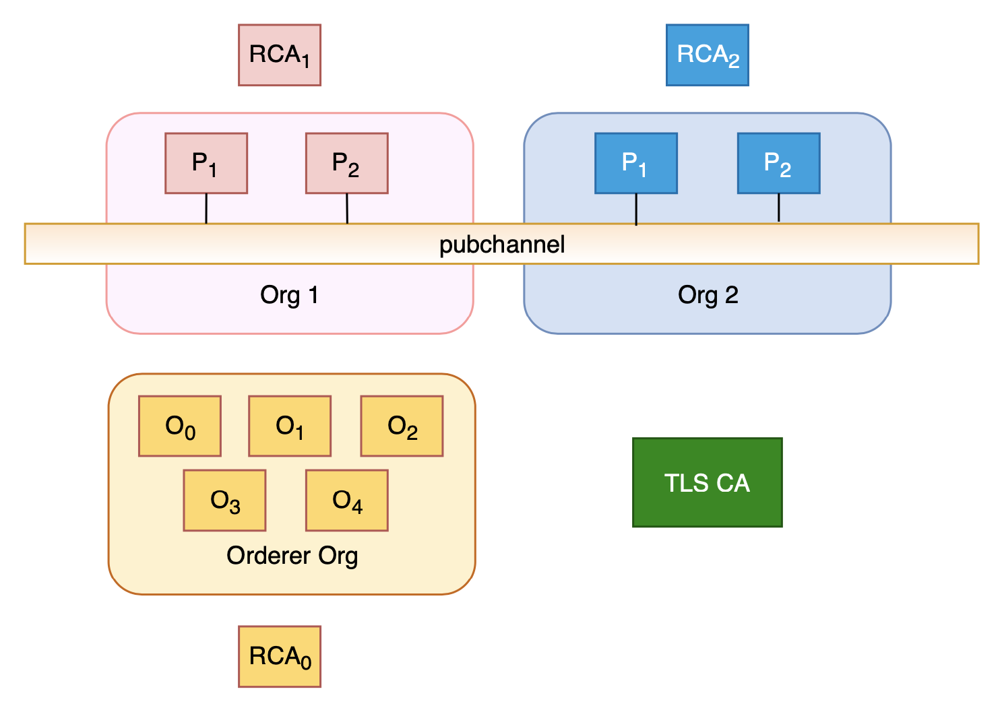

# Hyperledger Fabric 4 CAs Setup

`<Reference>` : <https://hyperledger-fabric-ca.readthedocs.io/en/latest/operations_guide.html>

Prerequsites: docker and docker-compose

***

## Topology



***

## Generate Network

1. Go to the template directory to generate the network. See [README](../../template/README.md) for the details.

2. After generated, ensure the files are executable.

```shell script
chmod -R 755 *
```

***

## Setup Fabric Network

To start the network, run the start command.

```shell script
./start.sh
```

```console
####
####  Fabric network started!
####
```

***

## Install and instaniate chaincode

```shell script
# Note: Yarn install is required for the FIRST TIME only
cd ../../packages/chaincode
yarn install

# Note: You need to ENSURE collecions.json is set correctly
cd ../../deployments/boilerplate
./installcc.sh
```

***

## Clean Up

If everything is good, we can clean up the environment. :tada::tada:

```shell script
./cleanup.sh
```

***

## Connection Profile

If you use the connection profiles, ENSURE the paths in connection profiles are set correctly. Precisely, replace the string **"boilerplate"** with your network folder name.
